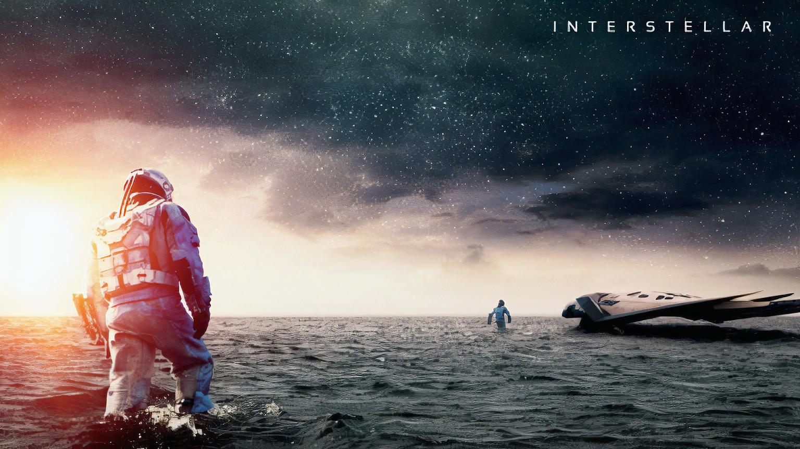

# Psychic-CCTV 

## Our Motivation :sunglasses:

Recently, one of our team members, [@abhijitramesh](https://github.com/abhijitramesh) has his bicycle stolen :motor_scooter:. He had gone shopping, parked his bicycle outside the store,
and by the time he returned his bicyle was missing :no_bicycles:. Gathering his wits, Abhijit looked around and saw a CCTV camera of the store which would have caught
the footage of the theft. So he went in and requested the store owners to let him see the footage :video_camera:. The footage was there, but it's resolution was not good enough 
for Abhijit to get any useful information. 

So Abhijit returned home, walking :walking:, thinking :thinking: that CCTV feeds are basically not very useful. Being a computer science student working with image processing, 
computer vision and deep learning, an idea struck him :bulb:. He called two of his other friends and laid down his plan so that the CCTV feeds like those could 
actually serve some purpose. 

And that idea, led to us building Psychic CCTY, a tool to make use of videos from CCTV feeds, as well as other kinds of videos, captured by people at a crime scene :information_source:.

***Based on a true story***

## What does Psychic CCTV do? :grey_question:

Psychich CCTV will help you analyse a video using the following methods:

- You have a video(even a low resolution one), and you're sure you might find some object of interest in the video, but you're too busy to sit and watch the entire
video. Even if you sit and watch the video, you might skip something by mistake, becuase after all, you're human. So we have provided an option to perform object detection
on the entire video, in real time which stores all frames with objects of interest. 

- Now, you did get an object of interest, but since you're not a computer, you still feel it could have a higher resolution. So used those saved frames and increase their 
resolution using our super-resolution technique. It works almost in real time, taking just 4-6 seconds to perform the operation on frame. 

- You already have a few images you want to analyse. Select them and run the super resolution on your own custom images :framed_picture:. 

- And finally, you might have a video recording with sound in it too. Now there's a lot of interference in the background, a lot of sound sources :sound:. So, select the video
and Psychich CCTV will extract the audio and split in into sources so you can clearly hear the vocals :speaking_head: and well as the background noise separately and gather useful information
from it :loudspeaker:.

## How does Psychic CCTV work? :thought_balloon:

### Super Resolution

In order to enhance the quality of images, we are using super resolution. Super resolution has been implemented by us from scratch completely in ***PyTorch***. After
researching a bit, we found two methods: 

- Using SRResnet
- Using SRGAN

So we decided to go ahead and implement both the methods. Once we had trained model for both, we ran them on a few photos and in the end, came the conclusion that 
SRGAN performs better than the SRResnet. 

- [SRResnet Model](https://github.com/Fireboltz/Psychic-CCTV/blob/master/superResModel/checkpoint_srresnet.pth.tar)
- [SRGAN Model](https://github.com/Fireboltz/Psychic-CCTV/blob/master/superResModel/checkpoint_srgan.pth.tar)
- [Training and Testing Scripts](https://github.com/Fireboltz/Psychic-CCTV/tree/master/superRes_Train)

Well, so this is the code. Now let's see how our super resolution models actually perform. 

|  |   |
|---|---|
| Input Image  | SRGAN Output  |

Being Halo fans, we first tried it out on a Halo poster, and voila! The output given by SRGAN is visibly more clear than the original input image. 

Next, we tried this on the legendary Insterstallar. 

|  |   |
|---|---|
| Input Image  | SRGAN Output  |

Here the results are clearly visible. The SRGAN output is far clearer than the input image. 

By now it was clear that the mode does work, but we just decided to do try it out on a photo of Lena. 

|  |   |
|---|---|
| Input Image  | SRGAN Output  |

And here, again the model did the work well. 

Next, we decided to try it out on a real CCTV feed. The next two exmaples are from a couple of CCTV photos that we found. 

|  |   |
|---|---|
| Input Image  | SRGAN Output  |

|  |   |
|---|---|
| Input Image  | SRGAN Output  |

Again, the results are way clearer and provide more visiblity than the input images. Had Abhijit been able to access this tool earlier, he might have been able 
to find some useful information from the CCTV feed and would still have his bicycle. 

### Object Detection

Abhijit just needed the super resolution technique to have a fix to his problem, but since we started out with the project, we decided to expand the functionality
a bit. We added an option to detect objects in video feeds as well. For this, we have used YOLO Object Detection, again implemented from scratch in ***PyTorch***.

- [YOLO Model](https://github.com/Fireboltz/Psychic-CCTV/blob/master/yoloModel/yolov3.weights)
- [YOLO Training Scripts](https://github.com/Fireboltz/Psychic-CCTV/tree/master/yolo_train)

A few sample outputs that we ran on a video:

|  |   |   | 
|---|---|---|
|  |  |  |

This feed detected monitors that weren't even turned on as were not in the focus on the camera. It detected a person as well whose back was turned. The method used will
automatically detect objects in a video feed and save all frames in which a new object might be detected. This will make it easier for a person to go through
objects of interest that might be present in a video feed without sitting and wathcing the entire feed themselves. 

### Separating Soundtracks

In videos that might be recorded at crime scenes such as accidents, hit and run cases, snatch thefts on roads, etc sound tracks play a very important role in addition to 
the video. Mostly when such a thing happens, someone or the other will end up recording a video on their phones. Now this video might be blurry, unstable, not of a high 
quality and all this is handled by our above mentioned steps, but at the same time the audio might also not be clear. If audio could be split into vocals and other
categories, it would be much easier to understand what happened. The sound of the car going away in a hit and run case in which the car directly isn't very visible 
would help in determining the model and make of the car. On the spot, people might exclaim and say some important visual details regarding a crime, but without the authorities
being present. More such things can be caught on video. In order to improve the process of analysing the audio, we extract the audio from a given video and 
split it into vocal and non-vocal using deep learning models. 

## How accessible is the tool? :roller_coaster:

Now all of this work has been done in python. But an officer who might be going through these videos might not be experinced enough in python to install alll the packages
and libraries needed and then run the code. 

So, we developed a desktop app while provides all the needed functionality in a GUI format. Our GUI is made using PySimpleGUIQt. This makes the application 
windows resize automatically, the appearence does not depend on the screen resolution. 

In order to simplify the process even more, we can provide packages for every OS, Windows, Linux and MacOS by packaging the entire application using PyInstaller. That 
way an initial set up using a requirements.txt is also not required. 

Screenshots of the application: 

|  |   |
|---|---|
| Object Detection Screen  | Dialog to allow user to choose the video to analyse  |

|  |   |
|---|---|
| Sound Extraction  | Frames with objects of interest displayed along with the option to perform super resolution  |

## Running the Project

To run the project, just execute the psychichCCTY.py script. Rest of the files were the ones used to do the intial groundwork of training models and getting them ready by testing them. 

```
python psychichCCTV.py
```

## Project Creators: :mortar_board:

[Vishwaak Chandaran](https://github.com/Vishwaak)

[Abhijit Ramesh](https://github.com/abhijitramesh)

[Yash Khare](https://github.com/yashk2000)
